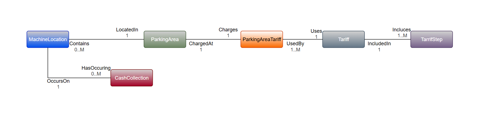
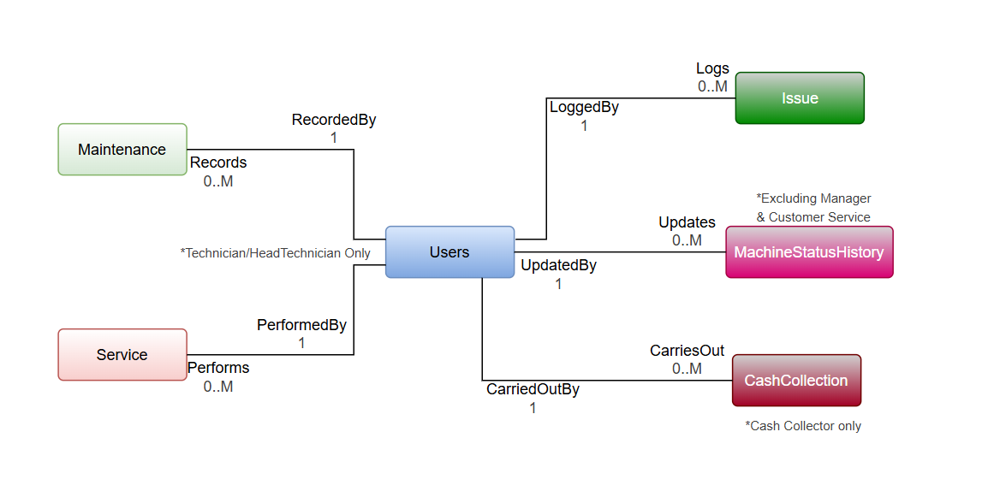

# P&D Machine Management System Database

COM7112 – Information Systems & Database Design

## Setup

1. Create a new MySQL database
2. Run database_dump.sql
3. Run queries in "SQL queries/" to test functionality

## Database ERD

### Machine Infrastructure & Operational Activities ERD

### Machine Location & Tariff ERD

### User Entity ERD
